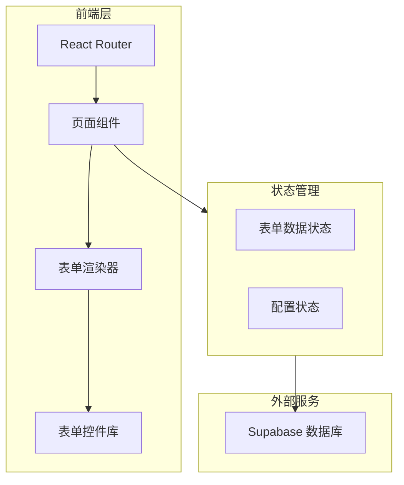
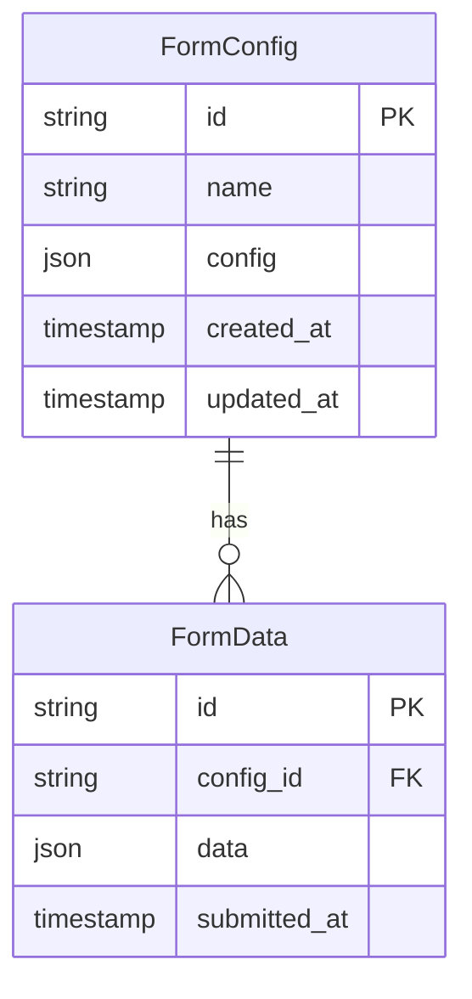

# JSON 表单渲染器 - 技术架构文档

## 1. 架构设计



## 2. 技术说明

- **前端框架**：React 18 + TypeScript
- **构建工具**：Vite 5.x
- **样式方案**：Tailwind CSS 3.x
- **路由**：React Router 6.x
- **后端服务**：Supabase（PostgreSQL + 实时订阅）
- **UI 组件库**：自定义实现，基于原生 HTML 元素

## 3. 路由定义

| 路由 | 用途 |
|------|------|
| `/` | 导入页面，支持 JSON 输入和文件上传 |
| `/renderer` | 独立渲染器页面，通过 URL 参数加载配置 |

## 4. 数据模型

### 4.1 表单配置数据模型



### 4.2 JSON 配置结构

```typescript
interface FormSchema {
  formConfig: {
    labelWidth: number;
    labelPosition: 'left' | 'right' | 'top';
    modelName: string;
    rulesName: string;
    customClass: string[];
    dataSources: DataSource[];
  };
  widgetList: Widget[];
}

interface Widget {
  id: string;
  type: string;
  key: number;
  formItemFlag: boolean;
  options: WidgetOptions;
}

interface WidgetOptions {
  name: string;
  label: string;
  required: boolean;
  disabled: boolean;
  hidden: boolean;
  placeholder?: string;
  defaultValue?: any;
  optionItems?: OptionItem[];
  [key: string]: any;
}
```

## 5. 核心组件设计

### 5.1 表单渲染器组件

```typescript
// 核心渲染器组件
interface FormRendererProps {
  schema: FormSchema;
  formData?: Record<string, any>;
  onSubmit?: (data: Record<string, any>) => void;
  onReset?: () => void;
}
```

### 5.2 控件映射表

```typescript
const widgetMap = {
  'input': InputWidget,
  'date': DateWidget,
  'select': SelectWidget,
  'radio': RadioWidget,
  'checkbox': CheckboxWidget,
  'switch': SwitchWidget,
  'rate': RateWidget,
  'date-range': DateRangeWidget,
  'time-range': TimeRangeWidget,
  'color': ColorWidget,
  'slider': SliderWidget,
  'html-text': HtmlTextWidget,
  'static-text': StaticTextWidget,
  'button': ButtonWidget,
};
```

## 6. Supabase 表结构

```sql
-- 表单配置表
CREATE TABLE form_configs (
  id UUID PRIMARY KEY DEFAULT gen_random_uuid(),
  name VARCHAR(255) NOT NULL,
  config JSONB NOT NULL,
  created_at TIMESTAMP WITH TIME ZONE DEFAULT NOW(),
  updated_at TIMESTAMP WITH TIME ZONE DEFAULT NOW()
);

-- 表单数据表
CREATE TABLE form_submissions (
  id UUID PRIMARY KEY DEFAULT gen_random_uuid(),
  config_id UUID REFERENCES form_configs(id) ON DELETE CASCADE,
  data JSONB NOT NULL,
  submitted_at TIMESTAMP WITH TIME ZONE DEFAULT NOW()
);

-- 创建索引
CREATE INDEX idx_form_configs_created_at ON form_configs(created_at);
CREATE INDEX idx_form_submissions_config_id ON form_submissions(config_id);
```

## 7. 项目结构

```
src/
├── components/
│   └── FormRenderer.tsx      # 表单渲染器（单文件）
├── pages/
│   ├── ImportPage.tsx        # 导入页面
│   └── RendererPage.tsx      # 渲染器页面
├── lib/
│   └── supabase.ts           # Supabase 客户端
├── types/
│   └── schema.ts             # 类型定义
├── App.tsx                   # 应用入口
├── main.tsx                  # 渲染入口
└── index.css                 # 全局样式
```
